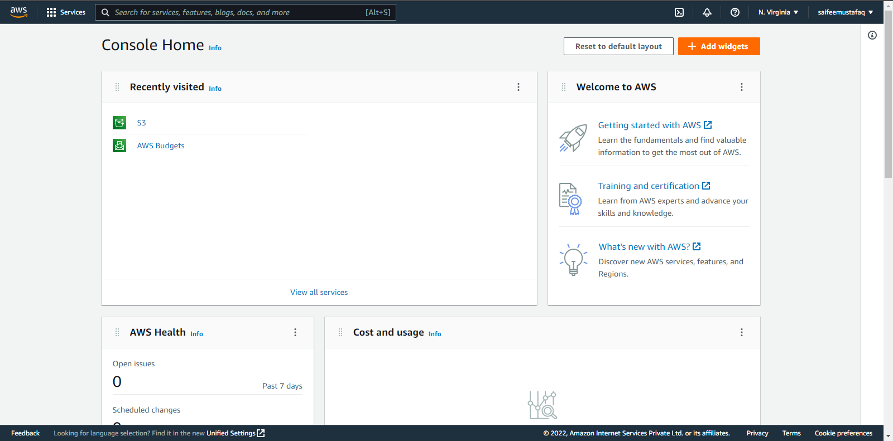

Let’s get started:

Sam is in the 3rd year of her engineering course. And she is worried about getting a project on her resume. After a lot of thought Sam decided to host a website, but was not sure what to host on the website. Sam asked her mentor about a solution, for which the mentor suggested that she should host her resume on a website using HTML and CSS, the task was simple, effective and impactful.

Sam decided to host it using AWS cloud, after a lot of reseaerch she wrote down the following data points:
- She wants the solution to be easy to understand and deploy.
- Using S3 bucket the solution would be fast and simple. And she can use the Static website hosting option to put the website live.

First step is to make a website using HTML CSS locally. Or you can consume this template(HTML/CSS) and edit the values as you want: https://github.com/saifeemustafaq/html_css_resume_template

(I am considering that you already have registered for an AWS account)

Head over to the AWS console: https://aws.amazon.com/console and type "**S3**" in the search bar right on the top. Click on **S3** that is now visible in the results.

