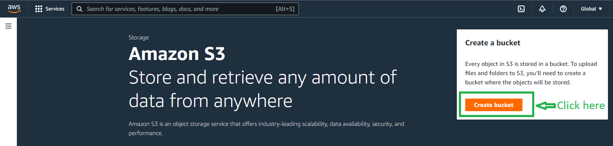

# Create a Static Website Using Amazon S3

Let’s get started:

Sam is in the 3rd year of her engineering course. And she is worried about getting a project on her resume. After a lot of thought Sam decided to host a website, but was not sure what to host on the website. Sam asked her mentor about a solution, for which the mentor suggested that she should host her resume on a website using HTML and CSS, the task was simple, effective and impactful.

Sam decided to host it using AWS cloud, after a lot of reseaerch she wrote down the following data points:
- She wants the solution to be easy to understand and deploy.
- Using S3 bucket the solution would be fast and simple. And she can use the Static website hosting option to put the website live.

## Part 1: Create an S3 bucket

### 1. First step is to make a website using HTML CSS locally. Or you can consume this template(HTML/CSS) and edit the values as you want: https://github.com/saifeemustafaq/html_css_resume_template

(I am considering that you already have registered for an AWS account)

### 2. Head over to the AWS console: https://aws.amazon.com/console and type "**S3**" in the search bar right on the top. Click on **S3** that is now visible in the results.

---

### 3. This will lead you to the following page where you have to click on _**Create bucket**_

---

### 4. On the next page where you will be creating the bucket:
- Give a unique name for the bucket in all small caps (example: bucketmaster9000)
- Find the section "Block Public Access settings for this bucket", uncheck the **Block all public access** option.
- An acknowledgement will open up as soon as you uncheck the **Block all public access**. Tick that box to acknowledge
- Finally leave rest of the options as it is and create the bucket.

## Part 2: Uploading the files and tweak the settings

Assuming that you have:
1. Either created your own HTML CSS files
2. Or you have downloaded the [index.html style.css](https://github.com/saifeemustafaq/html_css_resume_template/archive/refs/heads/master.zip)

For the sake of this tutorial I will be uploading the above downloaded files on the S3 bucket that we have created.
### 1. Uploading the files

Open the S3 bucket that you have created (_uniquebucketnamehere_ in my scenario) by ckicking on it.
Click on the **Upload** buttion on the following screen.
On the next page click on Add files(if you are adding the files directly) or Add folders(if you want to upload the whole folder containing the respective files) and proceed to selecting your files/folders

