# Create a Static Website Using Amazon S3

Let’s get started:

Sam is in the 3rd year of her engineering course. And she is worried about getting a project on her resume. After a lot of thought Sam decided to host a website, but was not sure what to host on the website. Sam asked her mentor about a solution, for which the mentor suggested that she should host her resume on a website using HTML and CSS, the task was simple, effective and impactful.

Sam decided to host it using AWS cloud, after a lot of reseaerch she wrote down the following data points:
- She wants the solution to be easy to understand and deploy.
- Using S3 bucket the solution would be fast and simple. And she can use the Static website hosting option to put the website live.

## Part 1: Create an S3 bucket

### 1. Get the files
First step is to make a website using HTML CSS locally. Or you can consume this template(HTML/CSS) and edit the values as you want: https://github.com/saifeemustafaq/html_css_jen_looper_template/archive/refs/heads/main.zip

This is how your resume will look at the end of this exercise: https://jlooper.github.io/build-resume-workshop/solution/

(I am considering that you already have registered for an AWS account)

---

### 2. Find S3
Head over to the AWS console: https://aws.amazon.com/console and type "**S3**" in the search bar right on the top. Click on **S3** that is now visible in the results.

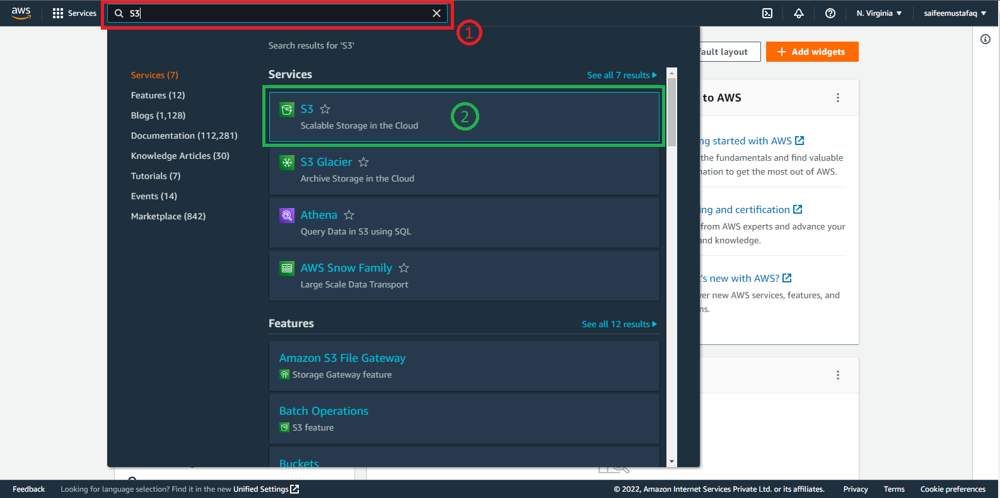

---

### 3. Bucket creation
This will lead you to the following page where you have to click on _**Create bucket**_


---

### 4. Bucket configuration
On the next page where you will be creating the bucket:
- Give a unique name for the bucket in all small caps (example: bucketmaster9000)
- Find the section "Block Public Access settings for this bucket", uncheck the **Block all public access** option.
- An acknowledgement will open up as soon as you uncheck the **Block all public access**. Tick that box to acknowledge
- Finally leave rest of the options as it is and create the bucket.

  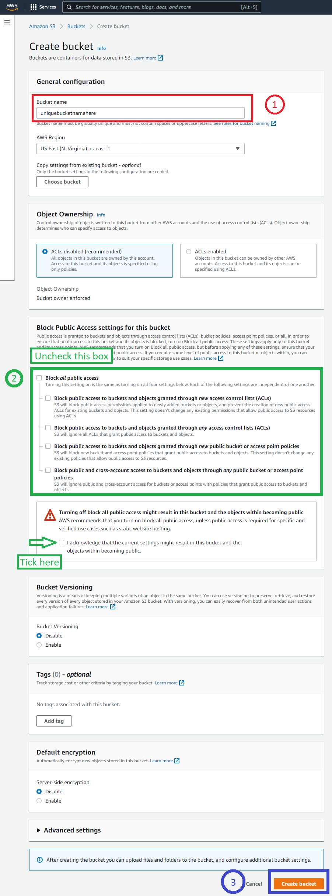

---

## Part 2: Uploading the files

- Assuming that you have:
  1. Either created your own HTML CSS files
  2. Or you have downloaded the [index.html style.css](https://github.com/saifeemustafaq/html_css_jen_looper_template/archive/refs/heads/main.zip)

- For the sake of this tutorial I will be uploading the above downloaded files on the S3 bucket that we have created.

- Open the S3 bucket that you have created (_uniquebucketnamehere_ in my scenario) by ckicking on it.

- Click on the **Upload** buttion on the following screen.

- On the next page click on Add files and proceed to selecting your files.

  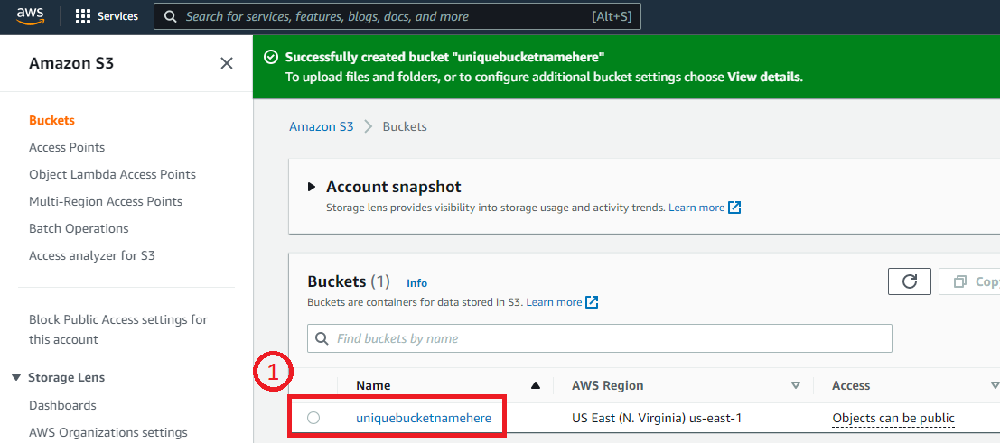
  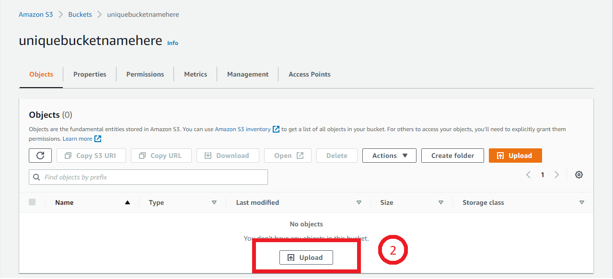
  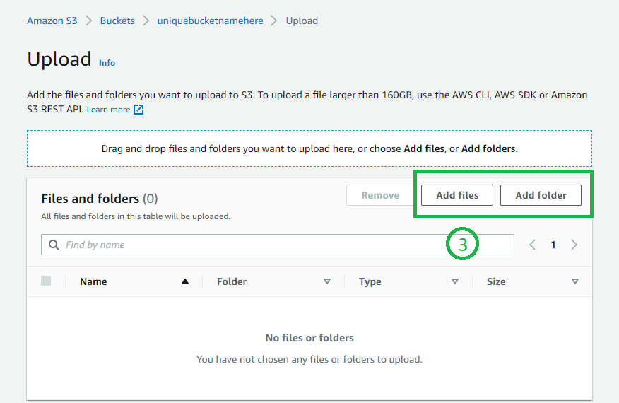

> I have downloaded the [index.html style.css](https://github.com/saifeemustafaq/html_css_jen_looper_template/archive/refs/heads/main.zip)
> 
> I will be uploading all the files here.

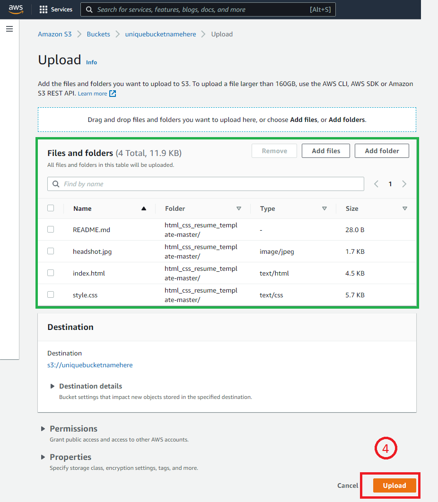

Uploading will start and once the upload is successful you will see the update on top of the screen saying **Upload succeeded**

## Recap
- We created an S3 bucket.
- Name of the bucket is unique
- Unchecked all the access blockers 
- Added files to the S3 Bucket we created

---

## Part 3: Configuring the S3 bucket for Static Website

- To start fresh, let's head to the top search bar on the AWS consile and search for S3 again. Click on the S3 service. You will see the S3 bucket page and the S3 resources as follows:

- You can see your bucket name here. Click on your bucket.

- Once your bucket is open, you can see the option of **Properties** just below your bucket name. Click on **Properties** and scroll down till the bottom of the page.

- The last division will be titled as **Static website hosting**. You can observe an Edit button in that section. Click on **Edit**

  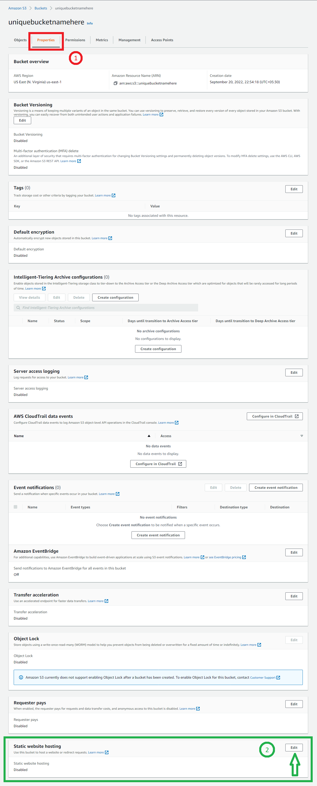

After clicking on the edit button, **Edit static website hosting** page will come up.

- Shift the radio selector **Enable** state

- Under Index document, type _index.html_

- Proceed to click on **Save changes**

  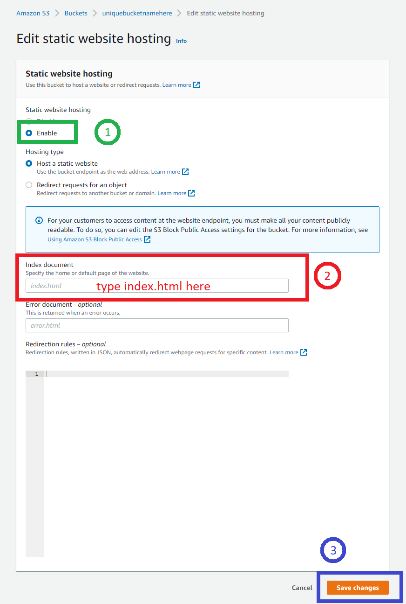

---

### Trying out the website

- Once you have enabled static website and clicked on save, you will be redirected back to the properties page.

- Scroll down to the bottom of the page to reach the **Static website hosting** section.

- You will see that Static Web Hosting is now enabled and there's a URL as well below. Click on the URL.

  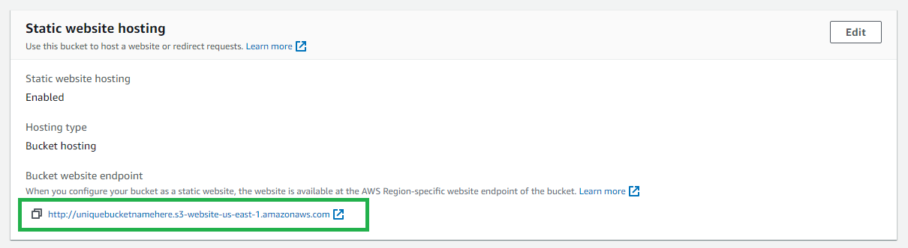

- A new tab will open up automatically to load your website.

- BUT you will see an error here. **403 Forbidden**

- A glimpse of the beautiful error:

  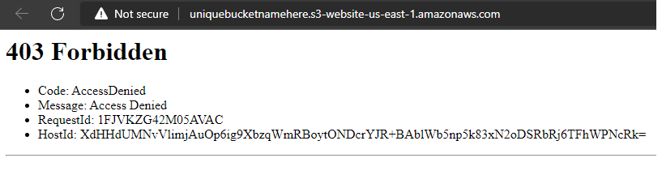

### Quick fix to 403

- Head over to the Permissions section of your S3 bucket.

- Scroll down and you will the section **Bucket policy**. Click on the **Edit** button under this section.

  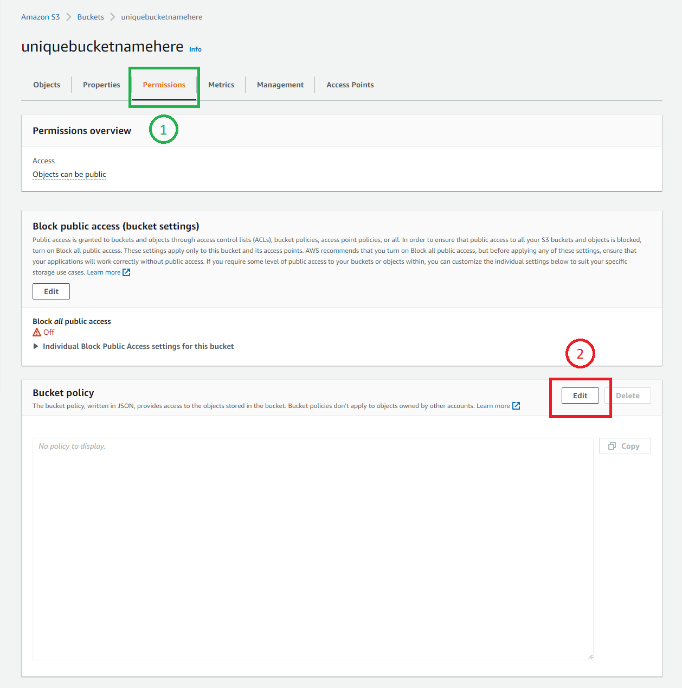

- You will be redirected to the _Edit bucket policy_ page. A piece of code needs to be added here:

```
{
    "Version": "2012-10-17",
    "Statement": [
        {
            "Sid": "PublicRead",
            "Effect": "Allow",
            "Principal": "*",
            "Action": [
                "s3:GetObject",
                "s3:GetObjectVersion"
            ],
            "Resource": "arn:aws:s3:::YOUR-S3-BUCKETNAME/*"
        }
    ]
}
```

- Replace `YOUR-S3-BUCKETNAME` with the name of your S3 Bucket.

  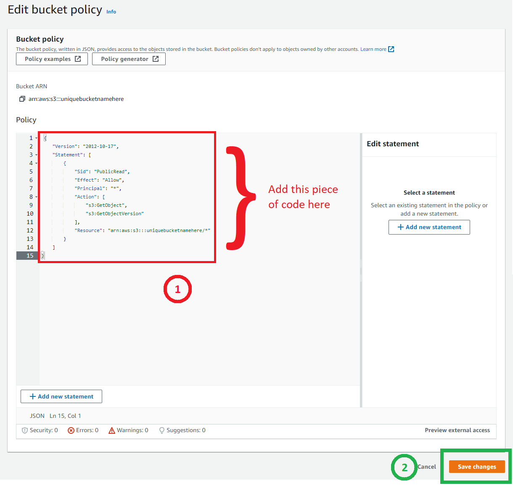

- Click on Save changes.

- Go back to Properties. Scroll down to the bottom till you reach Static website hosting section. Click on the URL.

And voila, your Static Resume Website is hosted.

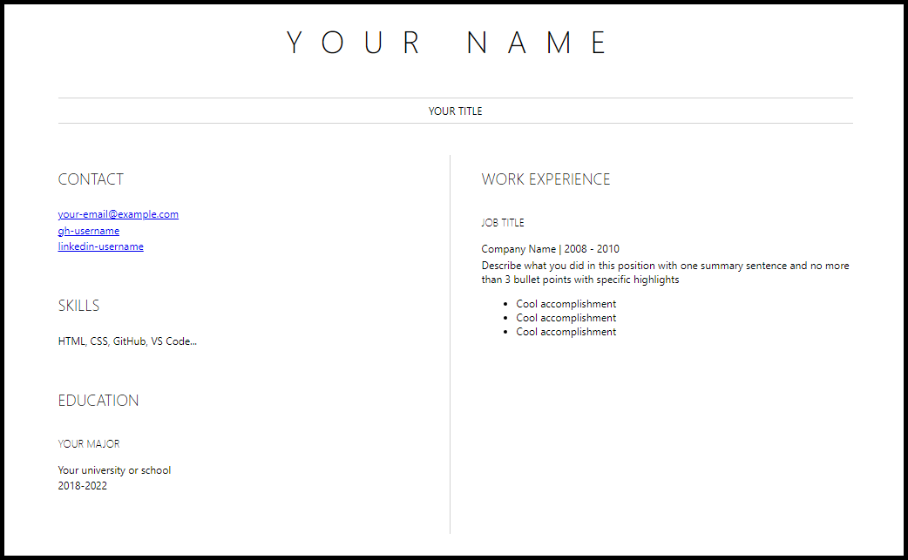