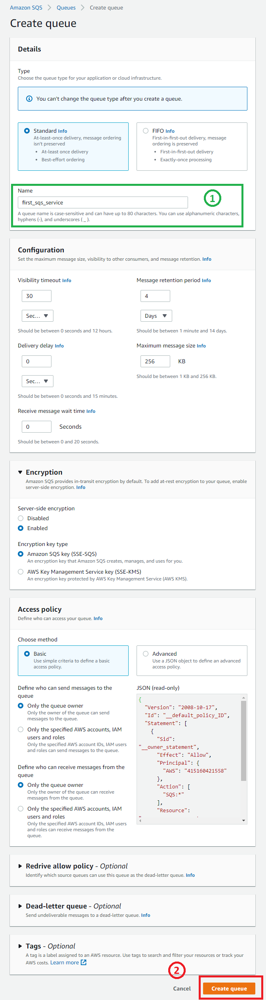
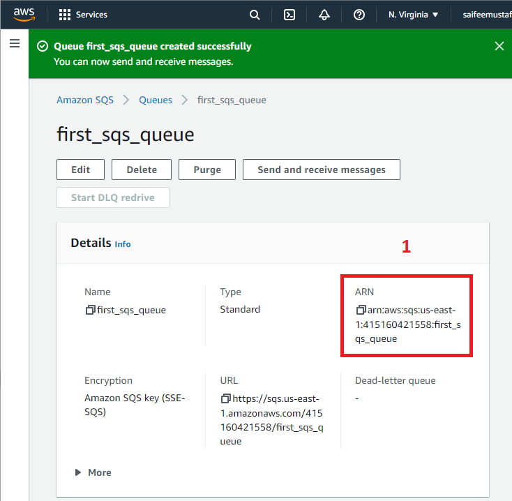
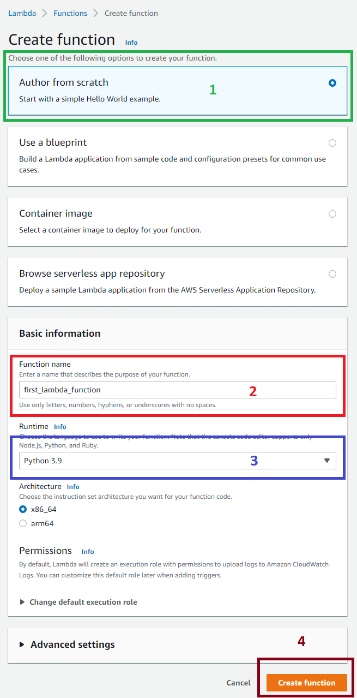
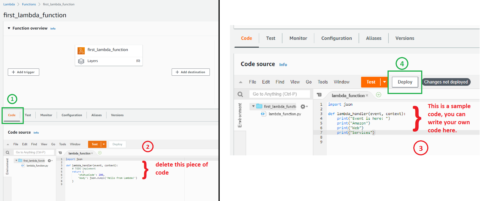
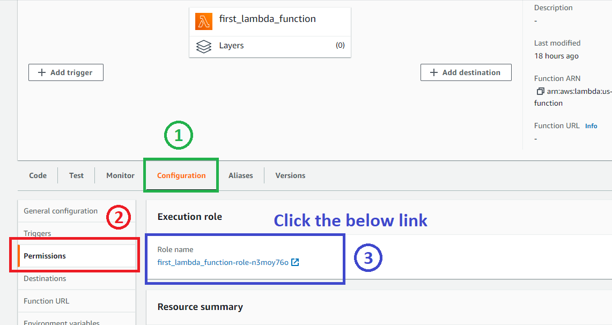

# In this exercise we will be triggering an AWS Lambda function from an Amazon SQS service

We will achieve this by doing the following tasks:
- Make an SQS instance
- Make a Lambda instance
- Add code to Lambda
- Provide SQS access to Lambda service
- Configure the SQS to send message to Lambda service

## Part 1: Make an SQS instance

1. In the top search bar, search for **SQS** and select **"Simple Queue Service"**.
2. The Simple Queue Service blade will open up where you have to click the **Create queue** button.
3. On the following page you will be asked to provide a unique queue name, leave rest options as it is and proceed to click **Create queue** at the very bottom.



Observe the highlighted ARN in the image below, copy it and store it some place safe.

> Headsup: Access privilege is required for SQS to let it access Lambda, so we have copied the ARN which will provide access to SQS to send messages to Lambda 




## Part 2: Make a Lambda instance

1. In the top search bar, search for **Lambda** and select **"Lambda"**.
2. The Lambda blade will open up where you have to click the **Create function** button.
3. On the following page, these options are important:
   - Select Author from scratch.
   - Give a unique function name.
   - I have selected Python 3.9 as the runtime for the function
   - Scroll down to the bottom and click on **Create function**.



Open your Lambda function that you just created (if not already opened). We will be writing the code that needs to be executed when the message from SQS is sent.

## Part 3: Add code to Lambda

As we will be triggering the Lambda from SQS service, we will actually be triggering the code that we write inside this Lambda function.

Let's add a piece of code to the Lambda function:
- Open the Lambda function you just created.
- Click on Code tab.
- Delete the existing code and you can put your own code. I have put a sample code here:
  ```
  import json

  def lambda_handler(event, context):
    print("Event is here: ")
    print("Amazon")
    print("Web")
    print("Services")
  ```
- Click on Deploy.

  

## Part 4: Provide SQS access to Lambda service

SQS will not have access to the Lambda function by default, so we need to provide the ARN of SQS to Lambda so that it can allow SQS to perform actions with Lambda function.

- We had copied the ARN of SQS before. But incase you haven't then open the SQS you created and copy the ARN. (See image below)
  

- Coming back to the Lambda function that we created you can see the *configuration* tab which is to the right of the *code* tab.

- Click on Permissions and you can observe a link below *Execution role*. Click on the link and you will be redirected to the *IAM Management Console*.
  

- On the IAM Management Console under the Permissions tab